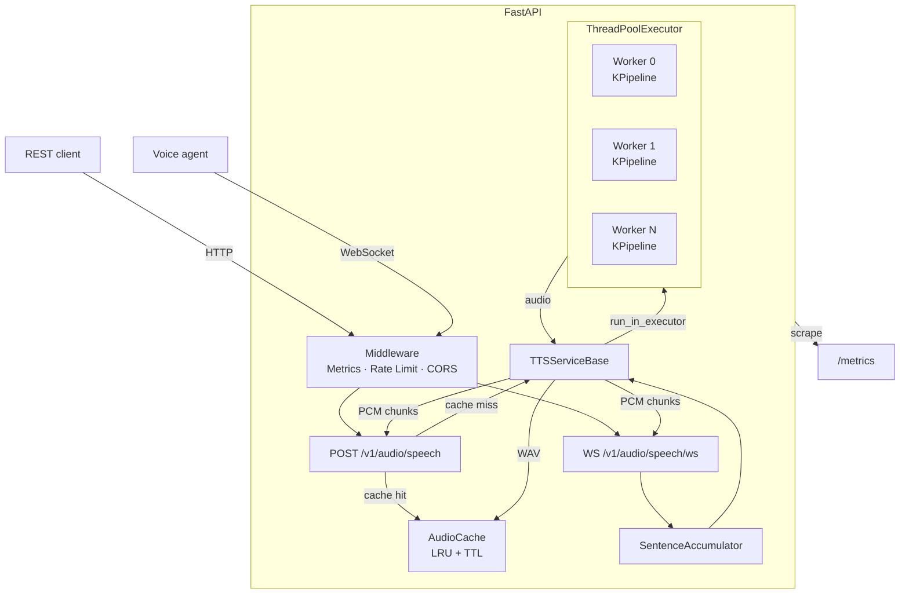
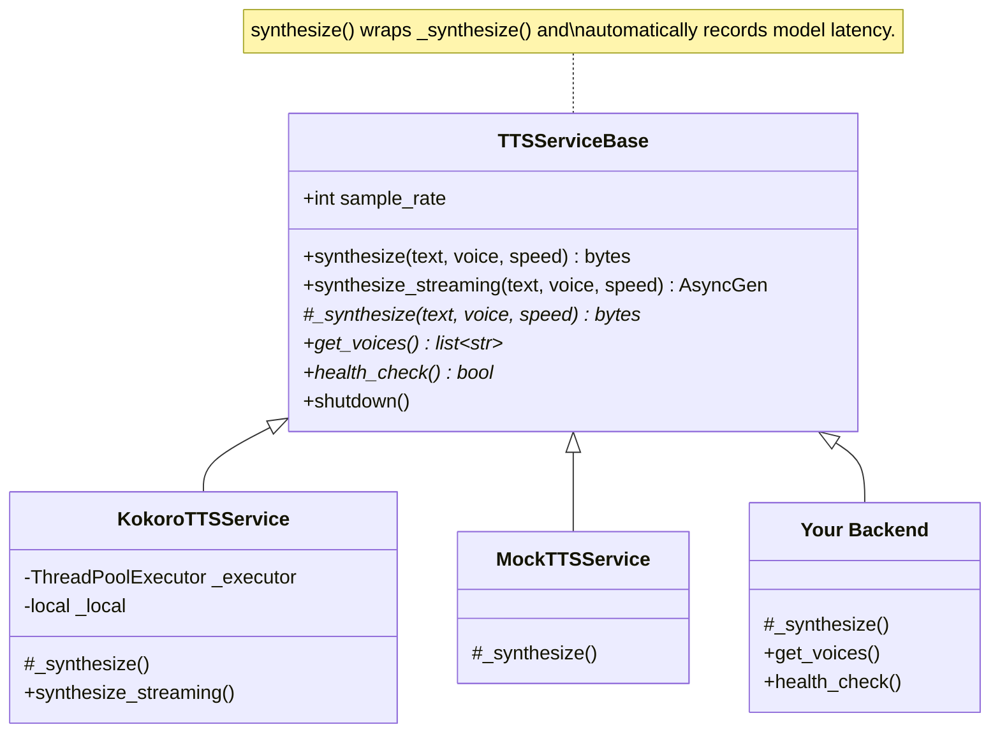

# Approach

## What I Built and Why

A production-ready Text-to-Speech API built on FastAPI, backed by the open-source [Kokoro-82M](https://huggingface.co/hexgrad/Kokoro-82M) model. The system exposes three API surfaces:

- **`POST /v1/audio/speech`** — OpenAI-compatible REST endpoint for single-shot and streaming synthesis
- **`WS /v1/audio/speech/ws`** — WebSocket endpoint for real-time voice-agent use cases (incremental text input)
- **`GET /v1/voices`** — lists available voices with language/gender metadata

A minimal browser UI at `/` exercises all three modes and provides interactive demo without any external dependencies.

### Why this architecture

The problem asks for a system that "could credibly operate" at high scale for voice agent use cases. That shaped every choice:

**Self-hosted model over cloud APIs.** I deliberately avoided cloud TTS providers (ElevenLabs, Google, AWS Polly). Cloud APIs introduce per-character cost that makes scale nonlinear in cost, whereas a self-hosted model turns inference cost into a fixed infrastructure cost. Kokoro-82M is a 82M-parameter model that runs on CPU, produces high-quality speech across multiple voices, and is Apache-licensed.

**Three API modes because different callers need different things.** Short IVR prompts want a simple request-response (buffered). Article narration wants progressive playback (HTTP streaming). Real-time voice agents receiving incremental text from an LLM want sub-sentence latency (WebSocket). Rather than force users to choose the right mode, the system auto-upgrades blocking requests to streaming when text exceeds 300 characters.

**Stateless HTTP layer for horizontal scaling.** The API server holds no durable state — cache and rate-limit state are in-process by default but designed for a Redis swap. Scaling means adding replicas behind a load balancer.

### System architecture



---

## Key Decisions and Tradeoffs

### Thread pool + asyncio concurrency model

Kokoro inference is CPU-bound PyTorch work. Running it directly on the asyncio event loop would block all other requests. The solution is a `ThreadPoolExecutor` where each worker thread owns a thread-local `KPipeline` instance via `threading.local()`.

The thread-local pattern is important: `KPipeline` contains mutable inference state (phonemizer context, model graph). Sharing a single instance across threads would require coarse locking that serializes all inference. Thread-local instances let N workers run fully in parallel, sharing only the underlying PyTorch weight tensors (which PyTorch handles safely at the C++ level).

For streaming, a worker thread pushes PCM chunks into an `asyncio.Queue(maxsize=16)` via `run_coroutine_threadsafe`, and the async generator yields from the queue. The bounded queue provides natural back-pressure: if a client is slow, the producer thread blocks rather than accumulating unbounded memory.

**Tradeoff:** Each thread-local `KPipeline` costs ~1-2 GB. With `TTS_MAX_WORKERS=4`, that's 4-8 GB baseline. This is the cost of true parallelism.

### Sentence accumulation for low-latency streaming

The `SentenceAccumulator` class detects sentence boundaries (`.!?` + whitespace, or newlines) in the incremental text stream. TTS is dispatched per sentence rather than per token or per full turn. This cuts first-audio latency from "wait for full LLM response" to "wait for first sentence" — typically 1-2 seconds instead of 10-30 seconds for a full response.

**Tradeoff:** Sentence detection uses a simple regex, not an NLP model. Edge cases like "Dr. Smith" or "U.S.A." can produce premature splits. This is acceptable because a false split produces a brief pause, not a failure.

### Audio cache (LRU + TTL)

A `cachetools.LRUCache` with TTL keyed by MD5 of `(text, voice, speed)` stores complete WAV files. This is high-value for voice agents that repeat common phrases ("I'm sorry, could you repeat that?", greetings, confirmation prompts), which can be served at <1ms instead of 2-5 seconds of inference. Default: 1,000 entries, 1-hour TTL.

**Tradeoff:** In-process cache doesn't survive restarts or share across replicas. Acceptable for single-node; needs Redis for production multi-replica.

### Celery + Redis job queue for bursty traffic

For traffic that exceeds worker capacity, a persistent job queue is more reliable than the in-process asyncio queue:

```
HTTP request → FastAPI → CeleryTTSService → Redis queue → Celery worker → Redis result/Pub/Sub → client
WebSocket    → FastAPI → KokoroTTSService (direct, bypasses queue — latency-sensitive)
```

The queue adds ~50-100ms overhead per request — negligible for buffered synthesis (2-5s total). Streaming works by publishing PCM chunks to a Redis Pub/Sub channel per sentence. Workers can scale independently of API servers.

**Tradeoff:** Additional infrastructure (Redis). WebSocket always bypasses the queue to avoid latency overhead.

| | Direct (ThreadPoolExecutor) | Queued (Celery + Redis) |
|---|---|---|
| Burst handling | In-memory, unbounded | Redis-backed, durable |
| Worker scaling | Tied to API server | Independent |
| Crash recovery | Request lost | Task re-queued (`task_acks_late=True`) |
| Latency | None | ~50-100 ms |

### Pluggable TTS backends

The TTS layer uses an abstract base class + factory pattern:



To add a new backend: subclass `TTSServiceBase`, implement three methods, add a branch in `factory.py`, set `TTS_BACKEND=mybackend`. A reusable conformance test suite (`TTSBackendConformance`) validates any new backend against the full contract with 9 tests for free.

### API key auth and rate limiting

HTTP endpoints accept `Authorization: Bearer <key>` or `X-API-Key: <key>`. WebSocket accepts `?api_key=<key>` as a query parameter — HTTP headers aren't available during the WebSocket upgrade handshake. When `TTS_API_KEYS` is empty, auth is disabled for local development.

Rate limiting is a token-bucket per client IP (60 req/min, burst 10) running as Starlette middleware.

**Tradeoff:** Both are in-process. Correct for single-node but break under multiple replicas (see next section).

### Observability

Metrics are recorded at two independent layers so every failure mode is visible — including 429, 401, 422 errors that never reach application logic:

| Prometheus query | Answers |
|---|---|
| `rate(http_requests_total[1m])` | RPS by endpoint and status |
| `histogram_quantile(0.99, rate(http_request_duration_seconds_bucket[5m]))` | P99 end-to-end latency |
| `histogram_quantile(0.95, rate(tts_stream_first_chunk_seconds_bucket[5m]))` | P95 time-to-first-audio |
| `rate(tts_cache_hits_total[5m]) / rate(tts_requests_total[5m])` | Cache hit ratio |
| `tts_active_websocket_connections` | Live voice-agent sessions |

### Testing strategy

The mock backend (`TTS_BACKEND=mock`) returns silent numpy arrays instantly, enabling fast tests with no model download. 100 tests cover the HTTP API, WebSocket, streaming, auth, caching, audio utilities, the TTS module interface contract, and a reusable conformance suite. The suite runs in ~0.2 seconds.

---

## What I Intentionally Left Out

**GPU support** — Kokoro works on CPU. Adding GPU would require CUDA, a different Dockerfile base, and device management. The architecture is GPU-ready (set `TTS_MAX_WORKERS=1` for a single GPU context), but I didn't want to bake in infrastructure assumptions.

**Distributed rate limiting** — Redis-backed atomic counters (`INCR`/`EXPIRE`) are the right answer. The in-process token bucket is correct for single-replica and the abstraction is clean enough to swap.

**Streaming WAV seeks** — The `0xFFFFFFFF` data-chunk size in the streaming WAV header means seek arithmetic is wrong. Acceptable for real-time playback, not for file downloads.

**SSML / pronunciation customization** — Kokoro accepts raw text only. No phoneme overrides, speed ramps, or pause injection.

**Voice cloning / custom voices** — Out of scope for a generic TTS API.

**Multi-language** — Kokoro covers American and British English. Other languages would require a multilingual model (StyleTTS2, Coqui XTTS) or language-specific backend instances — straightforward with the pluggable backend pattern.

---

## What Breaks First Under Pressure

### The core bottleneck: CPU-bound inference

FastAPI + asyncio handles thousands of open connections without blocking. The constraint is **TTS inference** — each call occupies one thread for ~2-5 seconds:

```
sustained throughput ≈ TTS_MAX_WORKERS / avg_inference_time
                     = 4 workers / 3s ≈ 1.3 req/s per container
```

Under a burst, requests queue in the asyncio event loop (unbounded). Response times grow linearly with queue depth. With Celery enabled, the queue moves to Redis (durable, bounded by memory), but throughput is still gated by worker count.

### Specific failure modes

| What breaks | When | Impact | Fix |
|---|---|---|---|
| **Rate limiter** | >1 replica | Each replica has its own token bucket — N replicas = N× the allowed burst | Redis `INCR` + `EXPIRE` sliding window |
| **Audio cache** | >1 replica or restart | No sharing, no persistence | Shared Redis cache |
| **Thread pool** | >1 req/s sustained (4 workers) | Requests queue, latency grows linearly | Horizontal scaling (more replicas) |
| **Disconnect during stream** | Client drops mid-stream | Worker thread blocked on `queue.put()` for 60s, holding a slot hostage | Cancellation `threading.Event` |
| **Memory under concurrent long-form** | Many simultaneous large requests | Each synthesis buffers full audio in RAM; 100 × 10MB = 1GB peak | Auto-stream threshold mitigates; hard concurrency limit would eliminate |

### Horizontal scaling

The service is stateless by design. Scaling out:

- **Multiple container replicas** behind a load balancer (nginx, K8s ingress)
- **`TTS_MAX_WORKERS`** should match physical CPU cores (not vCPUs — inference benefits from true parallelism, not hyperthreading)
- **WebSocket stickiness** — sessions are stateful for their lifetime; the load balancer needs session affinity

```
4 replicas × 4 workers × 0.33 req/s = ~5 req/s sustained
```

A Locust load test (`make loadtest`) profiles this precisely for a given pod spec — ramp users from 10 → 200 and watch where p99 crosses your SLA.

---

## What I'd Build Next

1. **Redis-backed cache + rate limiter** — makes the service truly stateless and ready for multi-replica deployment.

2. **Request priority lanes** — WebSocket connections (interactive, latency-sensitive) should preempt batch HTTP requests in the thread pool.

3. **SSML support** — prosody, pauses, and phoneme overrides matter for production voice agents.

4. **Async model warm-up** — currently the first request to each worker thread triggers model initialization (~2-4s). A background warm-up task on startup would eliminate cold-start latency spikes.

5. **Structured audio events in WebSocket** — emit sentence-level timestamps so clients can synchronize lip animation or subtitles.

6. **Production deployment** — the Docker image and `docker-compose.yml` are ready. Add: a reverse proxy for TLS termination, a Prometheus + Grafana stack for dashboards, and auto-scaling based on the `tts_active_websocket_connections` gauge.
