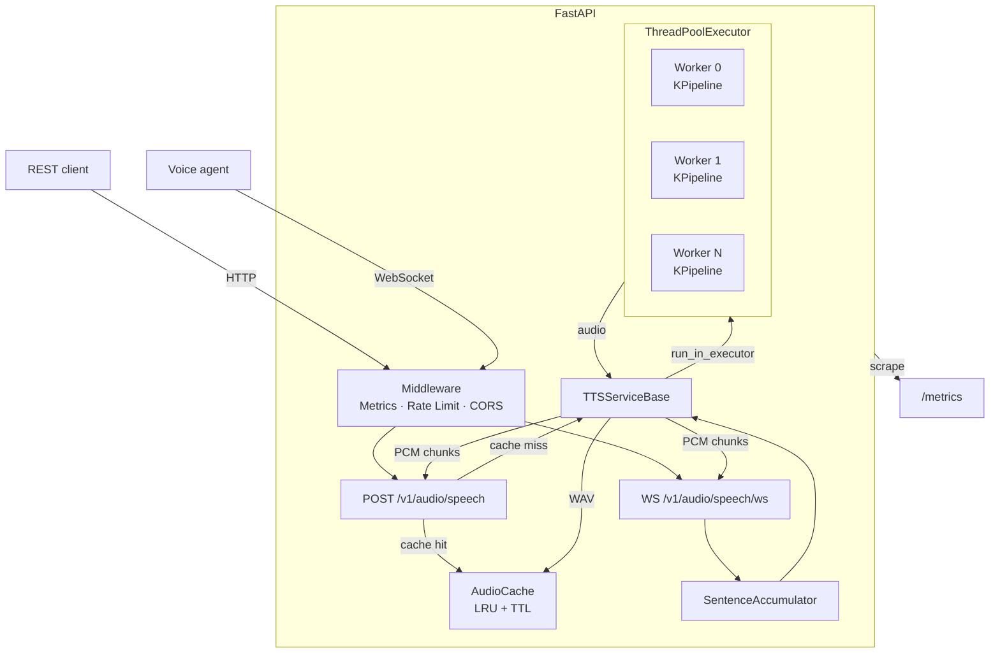
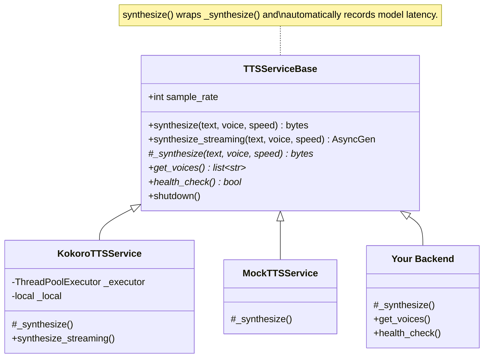

# Approach

## What I Built and Why

A production-ready Text-to-Speech API built on FastAPI, backed by the open-source [Kokoro-82M](https://huggingface.co/hexgrad/Kokoro-82M) model. The system exposes three API surfaces:

- **`POST /v1/audio/speech`** — OpenAI-compatible REST endpoint for single-shot and streaming synthesis
- **`WS /v1/audio/speech/ws`** — WebSocket endpoint for real-time voice-agent use cases (incremental text input)
- **`GET /v1/voices`** — lists available voices with language/gender metadata

A minimal browser UI at `/` exercises all three modes and provides interactive demo without any external dependencies.

### Why this architecture

The problem asks for a system that "could credibly operate" at high scale for voice agent use cases. That shaped every choice:

**Self-hosted model over cloud APIs.** I deliberately avoided cloud TTS providers (ElevenLabs, Google, AWS Polly). Cloud APIs introduce per-character cost that makes scale nonlinear in cost, whereas a self-hosted model turns inference cost into a fixed infrastructure cost. Kokoro-82M is a 82M-parameter model that runs on CPU, produces high-quality speech across multiple voices, and is Apache-licensed.

**Three API modes because different callers need different things.** Short IVR prompts want a simple request-response (buffered). Article narration wants progressive playback (HTTP streaming). Real-time voice agents receiving incremental text from an LLM want sub-sentence latency (WebSocket). Rather than force users to choose the right mode, the system auto-upgrades blocking requests to streaming when text exceeds 300 characters.

**Stateless HTTP layer for horizontal scaling.** The API server holds no durable state — cache and rate-limit state are in-process by default but designed for a Redis swap. Scaling means adding replicas behind a load balancer.

### System architecture



---

## Key Decisions and Tradeoffs

### Thread pool + asyncio concurrency model

Kokoro inference is CPU-bound PyTorch work. Running it directly on the asyncio event loop would block all other requests. The solution is a `ThreadPoolExecutor` where each worker thread owns a thread-local `KPipeline` instance via `threading.local()`.

The thread-local pattern is important: `KPipeline` contains mutable inference state (phonemizer context, model graph). Sharing a single instance across threads would require coarse locking that serializes all inference. Thread-local instances let N workers run fully in parallel, sharing only the underlying PyTorch weight tensors (which PyTorch handles safely at the C++ level).

For streaming, a worker thread pushes PCM chunks into an `asyncio.Queue(maxsize=16)` via `run_coroutine_threadsafe`, and the async generator yields from the queue. The bounded queue provides natural back-pressure: if a client is slow, the producer thread blocks rather than accumulating unbounded memory.

**Tradeoff:** Each thread-local `KPipeline` costs ~1-2 GB. With `TTS_MAX_WORKERS=4`, that's 4-8 GB baseline. This is the cost of true parallelism.

**Process isolation modes:** Where the model actually runs depends on whether the job queue is enabled:

```
Direct path (TTS_QUEUE_ENABLED=false):
┌─────────────────────────────────────────┐
│  uvicorn process                         │
│  ├─ asyncio event loop                  │
│  ├─ tts-worker-0  (thread, KPipeline)   │
│  ├─ tts-worker-1  (thread, KPipeline)   │
│  └─ tts-worker-N  (thread, KPipeline)   │
└─────────────────────────────────────────┘

Queue path (TTS_QUEUE_ENABLED=true):
┌──────────────────────┐   ┌──────────────────────────────┐
│  uvicorn process      │   │  celery worker (prefork)      │
│  (no model loaded)    │──▶│  ├─ worker-process-0          │
│  CeleryTTSService     │   │  │   KPipeline (own memory)   │
│  submits task →       │   │  ├─ worker-process-1          │
│  Redis broker         │   │  │   KPipeline (own memory)   │
└──────────────────────┘   └──────────────────────────────┘
```

In the **direct path**, the GIL is not a bottleneck: PyTorch releases it during C++ inference, so N worker threads genuinely run in parallel. A crash in a worker thread can, in the worst case, take down the whole uvicorn process.

In the **queue path**, each Celery worker is a separate OS process with its own memory space. The API server never loads the model (lower base memory, faster startup). A crashing worker process does not affect the API server — Celery restarts it automatically, and `task_acks_late=True` ensures the in-flight task is re-queued rather than lost.

### Sentence accumulation for low-latency streaming

**Linguistic Context vs. Latency**

I chose sentence-level buffering specifically to accommodate the Kokoro phonemizer’s dependency on local context.

**The Challenge**: TTS models, including Kokoro, determine pitch, duration, and stress based on the surrounding tokens. Synthesizing single words or short fragments in a "naive" stream results in "robotic" or flat intonation because the model lacks the look-ahead context to identify terminal punctuation or phrase boundaries.

**The Solution**: By using the SentenceAccumulator to hold tokens until a boundary (.!?) is reached, I ensure the model receives a complete semantic unit. This allows for natural prosodic contouring (e.g., rising pitch for questions) while maintaining a low Time-to-First-Audio (TTFA).

**The Result**: We achieve the "Best of Both Worlds"—the low latency of a stream with the high-fidelity emotional cadence of a batch-processed file.

### Audio cache (LRU + TTL)

A `cachetools.LRUCache` with TTL keyed by MD5 of `(text, voice, speed)` stores complete WAV files. This is high-value for voice agents that repeat common phrases ("I'm sorry, could you repeat that?", greetings, confirmation prompts), which can be served at <1ms instead of 2-5 seconds of inference. Default: 1,000 entries, 1-hour TTL.

**Tradeoff:** In-process cache doesn't survive restarts or share across replicas. Acceptable for single-node; needs Redis for production multi-replica.

### Celery + Redis job queue for bursty traffic

For traffic that exceeds worker capacity, a persistent job queue is more reliable than the in-process asyncio queue:

```
HTTP request → FastAPI → CeleryTTSService → Redis queue → Celery worker → Redis result/Pub/Sub → client
WebSocket    → FastAPI → KokoroTTSService (direct, bypasses queue — latency-sensitive)
```

The queue adds ~50-100ms overhead per request — negligible for buffered synthesis (2-5s total). Streaming works by publishing PCM chunks to a Redis Pub/Sub channel per sentence. Workers can scale independently of API servers.

**Tradeoff:** Additional infrastructure (Redis). WebSocket always bypasses the queue to avoid latency overhead.

| | Direct (ThreadPoolExecutor) | Queued (Celery + Redis) |
|---|---|---|
| Burst handling | In-memory, unbounded | Redis-backed, durable |
| Worker scaling | Tied to API server | Independent |
| Crash recovery | Request lost | Task re-queued (`task_acks_late=True`) |
| Latency | None | ~50-100 ms |

### Adaptive concurrency control

Even with a durable queue absorbing bursts, you still need a way to tell clients "slow down" before the server becomes overwhelmed. A durable queue can accept arbitrarily many tasks but that just moves the problem to unbounded queue depth and unbounded tail latency.

The solution is an **AIMD concurrency window** — the same algorithm TCP uses for congestion control — applied at the synthesis layer:

```
after each completed request:
  EWMA(latency) > target  →  limit *= 0.9    (multiplicative decrease — react fast)
  EWMA(latency) < 0.8 × target  →  limit += 1    (additive increase — probe slowly)
  otherwise  →  hold steady

if in_flight ≥ limit:  return 503 immediately  (fail-fast, not queue-and-wait)
```

The window starts at `TTS_MAX_WORKERS × 2` (allows some queuing above the thread pool depth) and self-tunes from there. Requests that arrive when the window is full get an immediate 503 with `Retry-After: 1` so clients can back off and retry — they never queue silently and accumulate unbounded wait time.

**Where it sits in the request path:**

- **Cache hits** bypass the limiter entirely — they do no synthesis work.
- **Buffered requests** acquire a slot after the cache miss, release it when synthesis completes (before response serialisation).
- **Streaming requests** acquire the slot inside `_generate()` *before the first yield*, so a 503 is still a proper HTTP error. The slot is held for the full stream duration, accurately reflecting that a worker is busy.
- **WebSocket** bypasses the limiter — voice agents are long-lived by design and latency-sensitive.

**Tradeoff vs. pure queueing:** The limiter sacrifices some throughput (it rejects requests rather than queuing them) in exchange for predictable latency. Under extreme overload, a 503 with `Retry-After: 1` is a better experience than a 30-second response — especially for voice agents where stale audio is useless.

**Configuration:**

| Env var | Default | Meaning |
|---|---|---|
| `TTS_ADAPTIVE_CONCURRENCY_ENABLED` | `true` | Toggle the limiter |
| `TTS_ADAPTIVE_CONCURRENCY_INITIAL` | `0` (→ `max_workers × 2`) | Starting window size |
| `TTS_ADAPTIVE_CONCURRENCY_TARGET_LATENCY_S` | `10.0` | EWMA latency target in seconds |

**Prometheus metrics:** `tts_concurrency_limit` (current window), `tts_concurrency_in_flight` (active slots), `tts_concurrency_rejected_total` (requests shed), `tts_concurrency_ewma_latency_seconds` (smoothed latency driving the algorithm).

### Pluggable TTS backends

The TTS layer uses an abstract base class + factory pattern:



To add a new backend: subclass `TTSServiceBase`, implement three methods, add a branch in `factory.py`, set `TTS_BACKEND=mybackend`. A reusable conformance test suite (`TTSBackendConformance`) validates any new backend against the full contract with 9 tests for free.

### API key auth and rate limiting

HTTP endpoints accept `Authorization: Bearer <key>` or `X-API-Key: <key>`. WebSocket accepts `?api_key=<key>` as a query parameter — HTTP headers aren't available during the WebSocket upgrade handshake. When `TTS_API_KEYS` is empty, auth is disabled for local development.

Rate limiting is a token-bucket per client IP (60 req/min, burst 10) running as Starlette middleware.

**Tradeoff:** Both are in-process. Correct for single-node but break under multiple replicas (see next section).

### Observability

Metrics are recorded at two independent layers so every failure mode is visible — including 429, 401, 422 errors that never reach application logic:

| Prometheus query | Answers |
|---|---|
| `rate(http_requests_total[1m])` | RPS by endpoint and status |
| `histogram_quantile(0.99, rate(http_request_duration_seconds_bucket[5m]))` | P99 end-to-end latency |
| `histogram_quantile(0.95, rate(tts_stream_first_chunk_seconds_bucket[5m]))` | P95 time-to-first-audio |
| `histogram_quantile(0.5, rate(tts_real_time_factor_bucket[5m]))` | Median RTF — <1.0 means faster than real-time |
| `rate(tts_cache_hits_total[5m]) / rate(tts_requests_total[5m])` | Cache hit ratio |
| `tts_active_websocket_connections` | Live voice-agent sessions |
| `rate(tts_model_errors_total[5m])` | Model failure rate by `error_type` (`oom`, `invalid_input`, `timeout`, `torch_error`) |
| `tts_cache_size` | Current cache utilisation (entries) |

A key production metric is **Real-Time Factor (RTF)** — `inference_time / audio_duration`. RTF < 1.0 means synthesis is faster than playback (good); RTF > 1.0 means the model can't keep up with real-time. This is recorded automatically as `tts_real_time_factor` for both buffered and streaming modes, labeled by voice. For streaming voice agents, RTF directly determines whether audio gaps occur between sentences.

### Testing strategy

The mock backend (`TTS_BACKEND=mock`) returns silent numpy arrays instantly, enabling fast tests with no model download. 100 tests cover the HTTP API, WebSocket, streaming, auth, caching, audio utilities, the TTS module interface contract, and a reusable conformance suite. The suite runs in ~0.2 seconds.

---

## What I Intentionally Left Out

**GPU support** — Kokoro works on CPU. Adding GPU would require CUDA, a different Dockerfile base, and device management. The architecture is GPU-ready (set `TTS_MAX_WORKERS=1` for a single GPU context), but I didn't want to bake in infrastructure assumptions.

**Distributed rate limiting** — Redis-backed atomic counters (`INCR`/`EXPIRE`) are the right answer. The in-process token bucket is correct for single-replica and the abstraction is clean enough to swap.

**Streaming WAV seeks** — The `0xFFFFFFFF` data-chunk size in the streaming WAV header means seek arithmetic is wrong. Acceptable for real-time playback, not for file downloads.

**SSML / pronunciation customization** — Kokoro accepts raw text only. No phoneme overrides, speed ramps, or pause injection.

**Voice cloning / custom voices** — Out of scope for a generic TTS API.

**Multi-language** — Kokoro covers American and British English. Other languages would require a multilingual model (StyleTTS2, Coqui XTTS) or language-specific backend instances — straightforward with the pluggable backend pattern.

**User management and request history** — The API is stateless and anonymous. A natural extension would be per-user accounts with request history (text, voice, timestamp, duration), quotas tied to user identity rather than IP, and persistent storage of generated audio so users can retrieve or re-download past results without re-synthesising. This would require a database (Postgres), an object store (S3 / GCS) for audio files, and an auth layer that issues user tokens rather than shared API keys.

**CI/CD pipeline** — No GitHub Actions workflows for running tests, linting, or deploying to a sandbox environment. In production I'd add: a CI job that runs `make lint` + `make test` on every PR, a build step that pushes the Docker image to a registry, and a CD step that deploys to a staging environment on merge to `main`. The Makefile targets and Dockerfile are already structured for this — the missing piece is the workflow YAML and a deployment target (e.g. Fly.io, Railway, or a K8s cluster).

**Model evaluation** — With only one backend (Kokoro) there's nothing to compare against today. When a second backend is introduced (or a model version is upgraded), a formal evaluation framework becomes critical. Metrics I'd evaluate on:

| Metric | What it measures | How |
|---|---|---|
| **Performance** | Inference latency (p50/p95/p99), throughput (RPS), time-to-first-audio for streaming | Prometheus metrics + Locust load tests (already instrumented) |
| **Audio quality** | Naturalness, intelligibility, prosody | UTMOS (automated MOS predictor), PESQ; human MOS ratings for major releases |
| **Robustness** | Handling of edge cases — numbers, abbreviations, URLs, mixed-case, long inputs | Curated test corpus with known-good reference audio, regression-checked in CI |
| **Speaker consistency** | Same voice sounds the same across requests and model versions | Speaker embedding cosine similarity (e.g. Resemblyzer) |
| **Resource efficiency** | Memory footprint, CPU utilization per request, cost per audio-minute | `kubectl top` + Prometheus under controlled load |

The pluggable backend pattern makes A/B evaluation straightforward — route a percentage of traffic to a candidate backend, collect metrics side-by-side, and promote or rollback based on quality + performance thresholds.

---

## What Breaks First Under Pressure

### The core bottleneck: CPU-bound inference

FastAPI + asyncio handles thousands of open connections without blocking. The constraint is **TTS inference** — each call occupies one thread for ~2-5 seconds:

```
sustained throughput ≈ TTS_MAX_WORKERS / avg_inference_time
                     = 4 workers / 3s ≈ 1.3 req/s per container
```

Under a burst, requests queue in the asyncio event loop (unbounded). Response times grow linearly with queue depth. With Celery enabled, the queue moves to Redis (durable, bounded by memory), but throughput is still gated by worker count.

### Specific failure modes

| What breaks | When | Impact | Fix | Mitigation |
|---|---|---|---|---|
| **Rate limiter** | >1 replica | Each replica has its own token bucket — N replicas = N× the allowed burst | Redis `INCR` + `EXPIRE` sliding window | Acceptable at low replica count; monitor `http_requests_total{status_code="429"}` for drift |
| **Audio cache** | >1 replica or restart | No sharing, no persistence | Shared Redis cache | Cache warm-up script for common phrases; cache misses only cost latency, not correctness |
| **Thread pool** | >1 req/s sustained (4 workers) | Requests queue, latency grows linearly | Horizontal scaling (more replicas) | K8s HPA on CPU utilization (target 70%); Celery queue absorbs bursts durably |
| **Memory under concurrent long-form** | Many simultaneous large requests | Each synthesis buffers full audio in RAM; 100 × 10MB = 1GB peak | Hard concurrency limit | Auto-stream threshold already limits buffered allocations; K8s memory limits + OOM protection |

### Cancellation and interrupted streams

A key concern for resource efficiency: when a WebSocket client disconnects mid-stream (e.g. user interrupts, network drop), the worker thread running TTS inference must stop promptly — otherwise it holds a thread pool slot for seconds synthesizing audio nobody will hear, starving waiting clients.

This is handled via a `threading.Event` cancellation signal threaded through the entire streaming path:

1. The WebSocket handler creates a `cancel` event and passes it to `synthesize_streaming(cancel=cancel)`
2. The Kokoro producer thread checks `cancel.is_set()` **between each sentence** in the KPipeline loop
3. On disconnect, the handler sets `cancel` in all exit paths (`WebSocketDisconnect`, exception, `finally`)
4. The async generator's `finally` block also sets `cancel` as a safety net (handles HTTP streaming disconnects and GC)

**Result:** On client disconnect, the worker thread stops after completing at most the *current sentence* (~0.3-0.5s) instead of the entire remaining text (potentially 10-30s). The thread is immediately available for the next waiting client. The `queue.put()` timeout was also reduced from 60s to 10s with graceful error handling, so even if the event loop is gone the thread unblocks quickly.

### Horizontal scaling

The service is stateless by design. Scaling out:

- **Multiple container replicas** behind a load balancer (nginx, K8s ingress)
- **`TTS_MAX_WORKERS`** should match physical CPU cores (not vCPUs — inference benefits from true parallelism, not hyperthreading)
- **WebSocket stickiness** — sessions are stateful for their lifetime; the load balancer needs session affinity

```
4 replicas × 4 workers × 0.33 req/s = ~5 req/s sustained
```

A Locust load test (`make loadtest`) profiles this precisely for a given pod spec — ramp users from 10 → 200 and watch where p99 crosses your SLA.

---

## What I'd Build Next

1. **Redis-backed cache + rate limiter** — makes the service truly stateless and ready for multi-replica deployment.

2. **Request priority lanes** — WebSocket connections (interactive, latency-sensitive) should preempt batch HTTP requests in the thread pool.

3. **SSML support** — prosody, pauses, and phoneme overrides matter for production voice agents.

4. **Async model warm-up** — currently the first request to each worker thread triggers model initialization (~2-4s). A background warm-up task on startup would eliminate cold-start latency spikes.

5. **Structured audio events in WebSocket** — emit sentence-level timestamps so clients can synchronize lip animation or subtitles.

6. **Production deployment** — the Docker image and `docker-compose.yml` are ready. Add: a reverse proxy for TLS termination, a Prometheus + Grafana stack for dashboards, and auto-scaling based on the `tts_active_websocket_connections` gauge.
